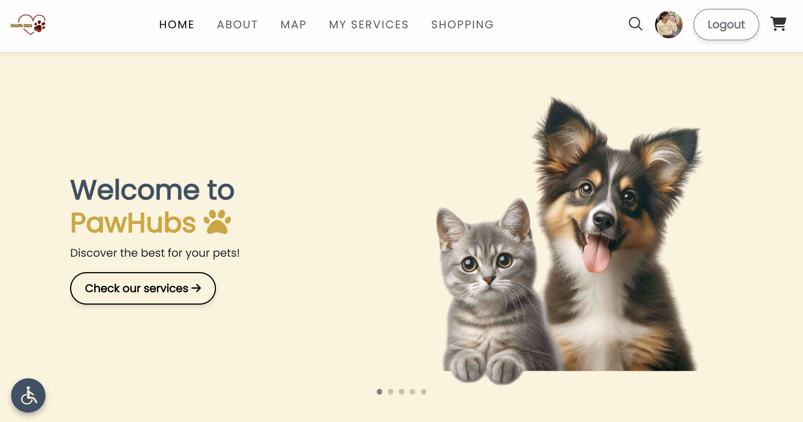

# All-Inclusive Pet Care Platform – Paw’s Hub

Paw’s Hub is a centralized, web-based pet care platform designed to bring together all essential pet-related services into one convenient and user-friendly system. The platform addresses the fragmentation in the pet care industry by integrating service booking, product purchasing, location discovery, and AI-powered assistance into a single ecosystem.


## 💻 Live Demo

<a href="https://pawshub.infinityfreeapp.com/" target="_blank">
  🌐 <strong>Visit Pawshub Live Website</strong>
</a>

---

## 🎥 Demo Video

<a href="https://drive.google.com/file/d/1WLK_qPKm5PQtWcnpW_7XsyK4GqXwOjch/view?usp=sharing">
  
</a>

## 📊 Project Presentation

<a href="presentation/EiPhyuSinOo_PawsHub_Final.pdf">
  <strong>Download Project Presentation (PDF)</strong>
</a>


## Project's Overview

Pet owners often struggle to manage different aspects of pet care across multiple disconnected platforms. Paw’s Hub solves this problem by providing:

- 📍Location-based service discovery
- 📅 Online booking system for pet services
- 🛒 Integrated e-commerce platform for pet products
- 🤖 AI-driven chatbot for instant pet care advice
- ⭐ Rating and review system for transparency and trust

The system supports three primary user groups:
- Pet Owners
- Pet Service Providers (Spas, Hospitals, Hotels)
- Pet Shops (E-Commerence) 

Each user type has a dedicated dynamic dashboard tailored to their needs.

---

## Key Features
### 📍 Interactive Map Integration
- Powered by Mapbox
- Displays nearby pet-related services and shops
- Provides location details, directions, and travel modes
- Uses geocoding and routing APIs for real-time interaction

### 📅 Booking Management System
- Pet owners can book pet spas, hospitals, and hotels
- Service providers can manage time slots and reservations
- Real-time booking updates and availability control

### 🛒 E-Commerce Module
- Browse products from multiple pet shops
- Add to cart and secure checkout
- Inventory management for pet shop owners
- Order tracking and purchase history

### 🤖 AI Chatbot Integration
- Built using Coze
- Provides instant pet care guidance
- Answers health, grooming, and general pet-related questions
- Enhances user engagement and accessibility

### ⭐ Rating & Review System
- Users can rate and review pet services
- Builds trust through transparency
- Helps other pet owners make informed decisions

### ♿ Accessibility & Usability
- Accessibility button (adjust text size, underline links, reset view)
- Designed with WCAG principles
- Responsive design across desktop, tablet, and mobile devices

---

## 🛠️ Technologies Used
- Frontend
  - HTML5, CSS3
  - Bootstrap
  - JavaScript
  - jQuery & Ajax
  - SweetAlert
  - Swiper.js / OwlCarousel
  - FontAwesome & Ionicons

- Backend
  - PHP (Server-side logic)
  - Session management
  - REST-style API integration

- Database
  - MySQL
  - Relational database design
  - ER modeling
 
- Third-Party Integrations
  - Interactive mapping powered by Mapbox
  - AI chatbot built using Coze

- Development Environment
  - XAMPP (Apache Web Server)
  - phpMyAdmin

---

## 🔄 Development Process

The system was developed following a structured Software Development Life Cycle (SDLC) methodology:

### Requirement Analysis

- Defined functional and non-functional requirements
- Identified system actors and use cases
- Conducted research on industry gaps

### System Design

- Designed logical architecture (Use Case & Activity Diagrams)
- Designed relational database schema (ER Diagram)
- Implemented RBAC model for access control
- Designed scalable multi-user architecture

### Implementation

- Developed modular PHP backend
- Implemented AJAX-based asynchronous updates
- Integrated external APIs for mapping and chatbot services
- Built responsive UI using Bootstrap

### Testing & Validation

- Input validation (client & server side)
- Booking conflict testing
- Session and authentication control testing
- Usability and accessibility testing

---

## Key Technical Achievements

- Designed and implemented a multi-role full-stack web system
- Built a real-time booking algorithm with constraint validation
- Implemented RBAC security model
- Integrated external APIs (Mapping + AI Chatbot)
- Designed normalized relational database schema
- Applied usability principles (Learnability, Flexibility, Robustness)
- Implemented accessibility features aligned with WCAG guidelines

---

## 🔐 Security Considerations

- Server-side input validation
- Session-based authentication
- Role-Based Access Control
- Error handling
- Booking conflict prevention

---

## ▶️ How to Run the Project

1. Install Requirements
- Install XAMPP
- Start Apache and MySQL

2. Clone Repository
```bash
git clone https://github.com/your-username/your-repository-name.git
```

3. Move Project Folder
Place the project folder inside /xampp/htdocs/

4. Setup Database
- Open: http://localhost/phpmyadmin
- Create database
- Import the provided .sql file
- Update database credentials in configuration file

5. Run the Application
- Open your browser and go to:
```bash
http://localhost/your-project-folder
```

---

### ⚠️ Demo Version Note Some features in the live demo version may not work properly due to hosting limitations (e.g., free hosting restrictions, server configuration, or database connectivity differences). However, the application works fully and correctly in the local development environment (localhost), where all features have been tested and function as intended.


